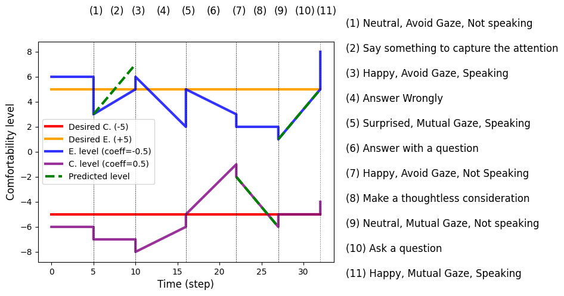

# PRISM- Personality Research in Synthetic Minds

## PRISM Cognitive Architecture

PRISM is a modular Cognitive Architecture designed to implement robotic personality in various agents.

### CEA Taxonomy

Personality is defined as a vector in a three-dimensional space defined by Conscientiousness, Extraversion, and Agreeableness (CEA), allowing the generation of infinite three dimentional personality profiles.  

$$
Personality= W_{c}C +  W_{e}E +  W_{a}A  (1)
$$

where \(C\), \(E\), and \(A\) are the unit vectors of the three axes, and \(W_{c}\), \(W_{e}\), and \(W_{a}\) represent the degree to which each trait is expressed, ranging from \([-1 (low), +1 (high)]\) with \(0\) indicating neutrality.

### Personality Generator

To model how personality influences action execution, we integrated language generation techniques into the Personality Generator, leveraging the BERT attention-based architecture. The personality model takes a defined personality (Equation 1) and a general action (e.g. speak about music, go near the person, pick the bottle.. ) as input, generating parameters that shape the action according to personality traits. These parameters include voice pitch, velocity, volume, language style, gaze behavior, gesture speed and amplitude, head movements, navigation speed, and proxemics. Here the set of parameters associated with the CEA traits.

**E**, **A**, **C** refer to personality traits (Extraversion, Agreeableness, Conscientiousness). **H** and **L** mean high and low values of the trait, respectively (e.g., **HE** = extraverted, **LE** = introverted).

| **Trait**                                       | **HE**                                                 | **LE**                      | **HC**                 | **LC**                                       | **HA**                                                             | **LA**                                                 |
| ----------------------------------------------- | ------------------------------------------------------ | --------------------------- | ---------------------- | -------------------------------------------- | ------------------------------------------------------------------ | ------------------------------------------------------ |
| **Language**  | Verbose, Friendly, Talkative, Enthusiastic, Excited | Reserved, Quiet, Neutral | Scrupulous, Precise | Thoughtless, Distracted, Lazy, Disordered | Cooperative, Friendly, Empathic, Forgiving, Reliable, Polite | Competitive, Aggressive, Provocative, Selfish, Rude |
| **Pitch**                    | High                                                   | Middle                      | Middle                 | Low                                          | Low                                                                | Middle                                                 |
| **Volume**                   | Very dynamic                                           | Middle                      | Middle                 | Low                                          | Dynamic                                                            | Dynamic                                                |
| **Velocity**                 | High                                                   | Middle                      | Low                    | Rather high                                  | Middle                                                             | Rather high                                            |
| **Gaze**                          | Mutual                                                 | Avoid                       | No active              | No active                                    | Mutual                                                             | Avoid                                                  |
| **Head Movements**              | Shaking                                                | Little shaking              | Tilt up shaking        | Tilt down shaking                            | Nodding                                                            | Little shaking                                         |
| **Gesture Amplitude**      | High                                                   | Low                         | Middle                 | Middle                                       | Middle                                                             | Middle                                                 |
| **Gesture Speed**         | High                                                   | Low                         | Middle                 | Middle                                       | Middle                                                             | Middle                                                 |
| **Navigation Speed**         | High                                                   | Low                         | Middle                 | Middle                                       | Middle                                                             | Middle                                                 |
| **Proxemic**                 | Near                                                   | Far                         | Middle                 | Middle                                       | Near                                                               | Far                                                    |

[Personality Generator](./Personality_Generator/Personality_Generator_Finetune.ipynb) folder contains the code used to finetune the BERT attention model.

### Prospection, Episodic Memory, Semantic Memory

Semantic Memory stores a personality-independent representation of the world through an ontology implementation (i.e., a set of propositions and predicates used to describe the world, which the system retrieves as needed) that allows us to capture its symbolic nature. [Semantic Memory Interface folder](./SemanticMemoryInterface/) contains the ontology and the code used to store predicates, functions on the Sematic Memory.

Prospection, or internal simulation, enables individuals to plan future actions while satisfying hedonic needs. 
Our implementation integrates the content of Semantic Memory with a Fast-Forward (FF) planner, using an iterative planning strategy. Within the planning domain (examples at [Prospection folder](./Prospection/)), for each CEA trait, we introduce numeric fluents to model Comfortability (Figure, blue and purple lines). The variation in Comfortability depends on the agent's personality definition (Equation (1)) and on the actions to be executed. The planner ensures that the absolute Comfortability (Figure, red and yellow lines) remains above a set threshold by introducing it as an action precondition.

Through this mechanism, the planner can regulate the variation of Comfortability with a predictive homeostasis (allostasis) behavior, and select the action path that best fulfills the hedonic experience of an agent with a specific personality defined within the CEA taxonomy. For instance, an extraverted agent in conversation may choose to answer with questions to sustain engagement or say something to capture attention if Comfortability drops below the threshold (Figure, actions (2), (10)).

Episodic Memory further refines this process by storing past experiences and outcomes, eventually reinforcing actions that elicit specific emotional responses. This component is responsible for evaluating whether the actual outcome (e.g., user emotions, gaze) of an action aligns with predictions, i.e., the aforementioned variation of Comfortability, adjusting this value accordingly (Figure, actions (2), (8), (10)). 
[Episodic Memory folder](./EpisodicMemory/) contains the code for each CEA pole used action selection process and weights update.
Furthermore, Comfortability is directly influenced by environmental stimuli such as user emotions and gaze, reflecting personality sensitivity to external cues. As it varies, the agent may take motivational goal actions without a direct practical objective, enhancing its perceived proactivity (Figure, actions (1-2)). 

### Emotion Generation

The component informs the GPT-4o model through the system prompt that its task is to serve as the emotion generator for an agent with a specific personality trait, describing the trait-related emotional intelligence in natural language. Additionally, we inform the LLM about the state of the agent and the interaction with the user. In particular, the actual input includes the following fields: text, which contains what the user said; user emotion, containing the detected user emotion; and comfortability, indicating whether the robot feels comfortable or uncomfortable. The complete set of system prompts is contained in [Emotion Generation folder](./EmotionGeneration/prompt/) 

In the practical integration of the generator into the cognitive architecture, since the system can manage three traits concurrently, we perform a weighted random selection by assigning different probabilities to each pole of the personality dimensions. Specifically, we randomly select one trait by considering the relative weights associated with each pole, reflecting their likelihood based on predefined probabilities. These weights depend on the robot's actual personality (as defined by the coefficient in Equation~(1)) and the sensitivity of each pole to the perceived emotion. In this way emotions are more frequently generated based on the emotional intelligence behaviors associated with the traits of agreeableness and extraversion.

## Experiments

## Publications

Nardelli, Alice, Carmine Recchiuto, and Antonio Sgorbissa. "A Software Framework to Encode the Psychological Dimensions of an Artificial Agent." 2023 32nd IEEE International Conference on Robot and Human Interactive Communication (RO-MAN). IEEE, 2023.

Nardelli, Alice, Antonio Sgorbissa, and Carmine Tommaso Recchiuto. "Personality-and memory-based software framework for human-robot interaction." 2024 IEEE International Conference on Robotics and Automation (ICRA). IEEE, 2024.

Nardelli, Alice, et al. "Personality-and memory-based framework for emotionally intelligent agents." 2024 33rd IEEE International Conference on Robot and Human Interactive Communication (ROMAN). IEEE, 2024.

Nardelli, Alice, et al. "Towards Intuitive Interaction: Cognitive Architecture for Artificial Personality, Emotional Intelligence, and Cognitive Capabilities." International Journal of Social Robotics (2025): 1-18.

Nardelli, Alice, et al. "Toward a Universal Concept of Artificial Personality: Implementing Robotic Personality in a Kinova Arm." arXiv preprint arXiv:2501.06867 (2025).

Corrao, Francesca, et al. "EmoACT: a Framework to Embed Emotions into Artificial Agents Based on Affect Control Theory." arXiv preprint arXiv:2504.12125 (2025).
