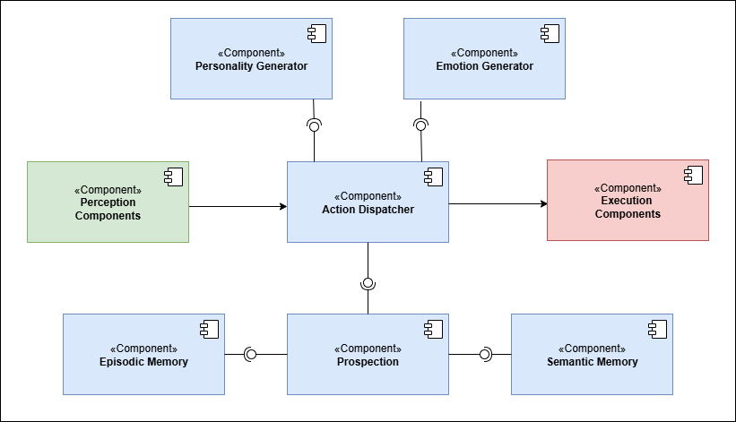

# PRISM- Personality Research in Synthetic Minds

## PRISM Cognitive Architecture

PRISM is a modular Cognitive Architecture designed to implement robotic personality in various agents.

### CEA Taxonomy

Personality is defined as a vector in a three-dimensional space defined by Conscientiousness, Extraversion, and Agreeableness (CEA), allowing the generation of infinite three dimentional personality profiles.  

$$
Personality= W_{c}C +  W_{e}E +  W_{a}A (1)
$$

where \(C\), \(E\), and \(A\) are the unit vectors of the three axes, and \(W_{c}\), \(W_{e}\), and \(W_{a}\) represent the degree to which each trait is expressed, ranging from \([-1 (low), +1 (high)]\) with \(0\) indicating neutrality.

### Personality Generator

